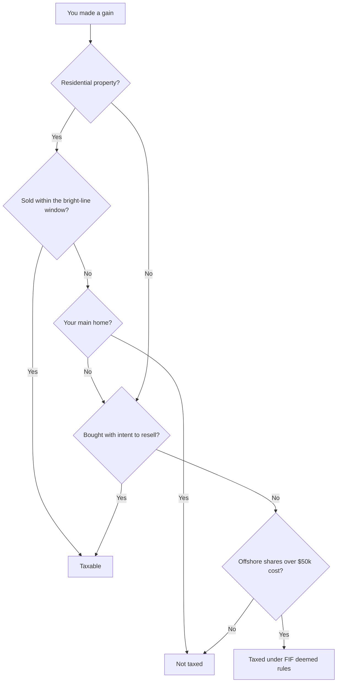
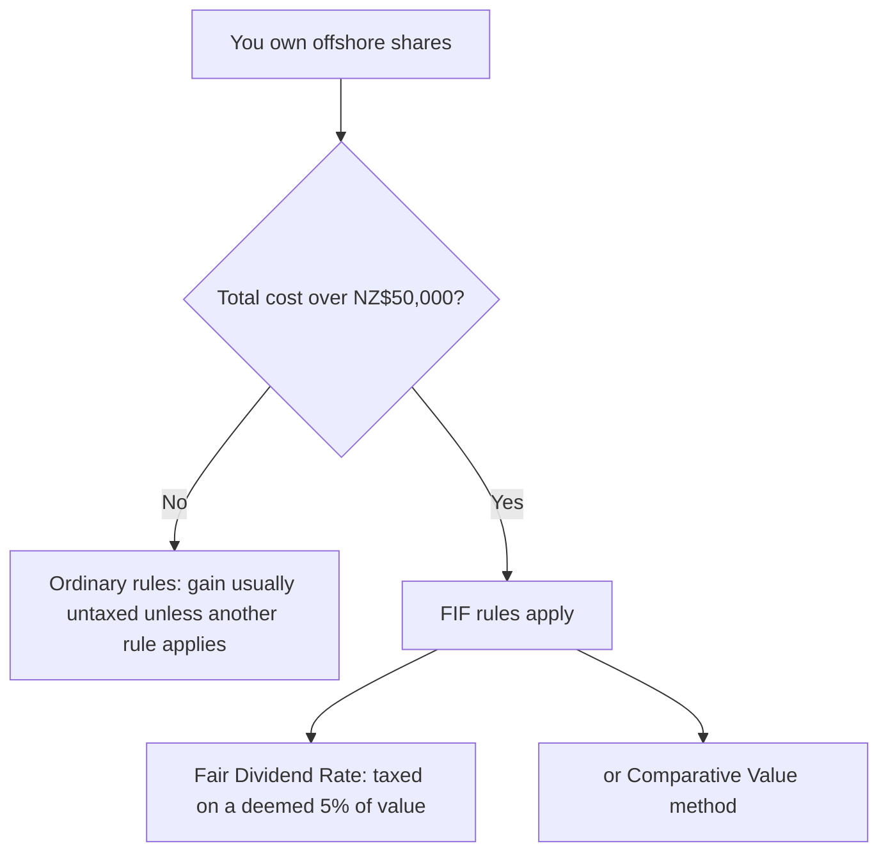

# course-package.md — How Capital Gains Are Taxed in New Zealand

> Generated by `format: course` from a dummy run. Subject: NZ capital gains tax.
> Audience: general (smart NZ layperson / first-time investor).

---

## A. BUILD NOTES

- This package is a self-contained brief for building a learner course on how
  capital gains are taxed in New Zealand. Paste it alongside your own builder prompt.
- It complements your prompt; it does not replace it. Nothing outside this file is required.
- §B's module/lesson order and prerequisites are **binding**; screen layout, navigation, and pacing are yours.
- §H (Style Guide) binds **every line of copy you write** — lesson cards and the connective text between them — so the seams never show.
- Build only from the facts in §E. To add a fact, flag it for human approval; do not invent.
- **Dummy-run caveat:** facts in §E and sources in §I are illustrative placeholders. Verify them against Inland Revenue before publishing.

---

## B. CONTENT BREAKDOWN

The curriculum for this subject. Ordering is given-before-new at curriculum scale: no lesson uses a concept an earlier lesson hasn't introduced.

| Module | Lesson | The idea | Facts | Visual | Hook suggestion | Prereq |
|---|---|---|---|---|---|---|
| **M1 — The front door that isn't there** | L1 | NZ has no general capital gains tax — most gains are simply not taxed | F1 | V1 | "You sold shares at a profit. The IRD shrugs. Usually." | — |
| | L2 | "Usually" is the whole course: specific rules still catch specific gains | F2 | — | "No front door, but the house has side entrances." | M1.L1 |
| | L3 | The map: four side doors — the clock, intention, land business, offshore | F2, F3, F5, F7 | V2 | "Four ways a gain still gets taxed." | M1.L2 |
| **M2 — The bright-line side door** | L1 | Sell residential property inside the bright-line window → the gain is taxable | F3 | — | "Bought in March, sold in October — that timing decides the tax." | M1.L3 |
| | L2 | The window has moved a lot; the date you bought sets your rules | F4 | V3 | "Same house, different decade, different tax." | M2.L1 |
| | L3 | The main-home exclusion: your family home usually walks free | F9 | V4 | "Does your own home count? Run it." | M2.L2 |
| **M3 — The intention side door** | L1 | Buy *intending* to resell → the gain is income, no clock required | F5 | — | "It's not what you sold. It's why you bought." | M1.L3 |
| | L2 | This catches shares too, not just property | F5 | — | "The day-trader and the flipper get the same letter." | M3.L1 |
| | L3 | Proving intention: records and patterns decide it | F5, F6 | — | "Intention isn't a feeling. It's a paper trail." | M3.L2 |
| **M4 — The offshore side door (FIF)** | L1 | Most overseas shares are taxed on a *deemed* return, not the actual gain | F7 | V5 | "You didn't sell, but you're still taxed. Welcome to FIF." | M1.L3 |
| | L2 | The ~$50k cost threshold decides whether FIF even applies | F7 | — | "Under the line, ordinary rules. Over it, a different world." | M4.L1 |
| | L3 | Why deemed, not actual: the logic of the Fair Dividend Rate | F7 | — | "Taxed on 5% you might never have earned. Here's why." | M4.L2 |
| **M5 — Why the front door stays shut** | L1 | A 2019 review recommended a full CGT; it was rejected | F8 | — | "We came one report away from a front door." | M1.L1 |
| | L2 | What "no CGT" actually leaves taxed — the four doors, recapped | F3, F5, F7, F9 | V2 | "No general tax. Four specific ones. Know the difference." | M2–M4 |
| | L3 | Capstone: predict the tax for four worked sales | F3, F5, F7, F9 | V7 | "Four sales. Which ones does the IRD tax?" | M5.L2 |

**Deliverables coverage** (from the brief's goal — a learner can predict whether a gain is taxable in NZ and explain why):
- D1 *state that NZ has no general CGT* → M1
- D2 *apply the bright-line test to a property sale* → M2
- D3 *identify the intention and FIF rules that still tax gains* → M3, M4
- D4 *predict taxability across mixed scenarios* → M5.L3

### Architecture laws (binding on the builder)

- **One idea per card, 40–150 words.**
- **Every lesson runs HOOK → CONCEPT → EXAMPLE → CHECK.** Phrase checks as predictions or tasks, never "did you understand?"
- **Modules are 3–7 lessons.** Open each with why-this-matters; close with a one-line-per-lesson recap.
- **The final module is written at the depth of the first.** Fading effort is a defect.

### SAMPLE card — M1.L1 (calibration only; the builder writes every other card)

> **HOOK.** You sell shares in a Kiwi company for $8,000 more than you paid, and brace for the tax bill. It never comes.
>
> **CONCEPT.** New Zealand has no general capital gains tax. When something you own — shares, a business, a rental — rises in value and you sell, that profit is, by default, not taxed at all. That default is unusual: most comparable countries tax it. Here, the starting point is silence.
>
> **EXAMPLE.** Buy $20,000 of shares, sell years later for $28,000. The $8,000 gain is yours. No line on the return claims it.
>
> **CHECK.** A friend insists every country taxes investment profit. Name the default New Zealand rule that proves them wrong.

---

## C. VISUAL DIRECTIVES

Every visual this subject earned, in spec syntax. Each carries its takeaway; a visual that cannot state its takeaway in one sentence is decoration — cut it. Chart data lives once, in §D.

```
TABLE:   id=V1 | data=T1 | message="New Zealand is the outlier — its peers tax capital gains; it does not."
```

```
DIAGRAM: id=V2 | mermaid | message="A gain is taxed in NZ only if it falls through one of four specific doors."
```


```
CHART:   id=V3 | type=step | x="effective date" | y="bright-line period (years)" | data=T2 | message="The bright-line window stretched to ten years, then snapped back to two."
```

```
WIDGET:  id=V4 | type=calculator | inputs=<purchase date, sale date, main-home? (y/n)> | output=<taxable under bright-line: yes / no> | behavior="apply the bright-line period in force at the purchase date; if main-home, exempt" | success="the learner sees that the same sale is taxable or not depending only on the purchase date and main-home status"
```

```
DIAGRAM: id=V5 | mermaid | message="Cross the $50k offshore-shares threshold and you leave ordinary rules for FIF's deemed-return world."
```


```
WIDGET:  id=V7 | type=sorter | inputs=<four sale scenarios: a 1-yr rental flip, a 12-yr family home, US shares held long-term, NZ shares bought to trade> | output=<each dragged into "taxed" or "not taxed"> | behavior="score against the four doors in V2" | success="the learner correctly predicts all four and can name which door applies"
```

### Decision table — when to add a visual (binding on the builder)

| The content is… | Use a… |
|---|---|
| numbers with a shape (trend, comparison, distribution) | **chart** |
| a process or structure (steps, relationships) | **diagram** |
| side-by-side attributes | **table** |
| a cause-effect the learner should *feel* | **widget** |
| a single idea | **prose** — visuals are never ornament |

**Placement law:** the visual sits after the CONCEPT it serves, before the CHECK.

---

## D. DATA TABLES

The single home of all numbers in this package. Every row sourced.

**T1 — General capital gains tax, NZ vs selected peers** [S4]

| Country | General capital gains tax? |
|---|---|
| New Zealand | No |
| Australia | Yes |
| United Kingdom | Yes |
| United States | Yes |
| Canada | Yes |

**T2 — Bright-line period history** [S2]

| Effective from | Applies to property acquired on/after | Bright-line period |
|---|---|---|
| 1 Oct 2015 | 1 Oct 2015 | 2 years |
| 29 Mar 2018 | 29 Mar 2018 | 5 years |
| 27 Mar 2021 | 27 Mar 2021 | 10 years (5 for new builds) |
| 1 Jul 2024 | sales from this date | 2 years |

**T3 — FIF quick numbers** [S5]

| Item | Value |
|---|---|
| De minimis threshold (cost of offshore shares) | NZ$50,000 |
| Fair Dividend Rate (deemed return) | 5% |

---

## E. FACT SHEET

The builder writes from these facts and no others. To add one, flag it for human approval.

- **F1** [S-strong] — NZ has no comprehensive/general capital gains tax — one of the few OECD countries without one.
- **F2** [S-strong] — Certain gains are still taxed as ordinary income under specific rules, not under a CGT regime.
- **F3** [S-strong] — The bright-line test taxes gains on residential property sold within a set period of purchase.
- **F4** [S-medium] — Bright-line period history: 2 yrs (2015) → 5 yrs (2018) → 10 yrs (Mar 2021) → back to 2 yrs (1 Jul 2024).
- **F5** [S-strong] — The "intention" test: property or shares bought with the purpose of resale are taxed as income, regardless of the bright-line clock.
- **F6** [S-medium] — Land-dealing, development, and subdivision rules tax gains for those in the business of land.
- **F7** [S-medium] — Foreign Investment Fund (FIF) rules tax most offshore shares on a deemed basis (e.g. 5% Fair Dividend Rate) once holdings exceed ~NZ$50,000 cost.
- **F8** [S-strong] — The 2019 Tax Working Group recommended a broad capital gains tax; the government ruled it out.
- **F9** [S-strong] — The main home / family home is generally excluded from the bright-line test.

---

## F. TONE INSTRUCTIONS

- The learner is a numerate New Zealand adult — owns or wants to own a home, KiwiSaver, maybe some shares. Reads the news; has never read tax law.
- **Already knows (never re-explain):** what shares, a rental, a mortgage, and IRD are; that profit is income; that property is central to NZ wealth.
- **Register:** plain, direct, adult. Define a tax term once, in plain words, then use it.
- **Talking down to this audience** = explaining what a share or a landlord is, or treating "no CGT" as too clever for them to grasp.
- **Fixed bans:** second person, present tense throughout; no exclamation-mark enthusiasm; no "simply / just / easy"; no congratulation filler.
- **Encouragement only as information:** end each module by naming what the learner can now do that they couldn't before — e.g. "You can now read a sale date and say whether the bright-line test bites."

---

## G. IMAGERY REPERTOIRE

**Controlling metaphor:** *the house with no front door, but several side doors.* NZ has no general CGT — the front door every other country fits — yet specific gains still get taxed by slipping through specific side doors. Drawn from the audience's own world (houses, doors, thresholds), and apt because property sits at the centre of NZ's gains rules.

**Planned extension, module by module:**
- **M1** — introduced at its simplest: no front door; gains walk straight through.
- **M2** — the *clock door* (bright-line), with a timing latch.
- **M3** — the *intention door* (why you bought, not what you sold).
- **M4** — the *offshore door*, with the $50k threshold as the doormat you step over.
- **M5** — the front door shown bricked up *on purpose*; the metaphor closes the argument, it is not replaced.

**Supporting analogies** (same domain, mapped to lesson):
- "the timing latch" → M2.L2 (the bright-line clock as a latch on the clock door).
- "the doormat / threshold" → M4.L2 (the ~$50k FIF threshold).

**Licensed memes:** none (audience is general; the format would permit, the audience does not).

**Usage rules (binding on the builder):**
- The controlling metaphor *unfolds* — introduced at its simplest in M1, extended, **never replaced**.
- Supports live in the same source domain (houses/doors/thresholds), or one declared compatible here.
- Nothing off this map appears in any card.
- An image is explained at most once, at first use.
- **Condescension gate** — would this audience use this image among themselves? — applies to anything you add.

---

## H. STYLE GUIDE

Prose is a window: the writer has seen something, and the words exist to let the reader see it too. Write about the subject, never about the writing — no "in this section," no "it's important to note," no narrating what the text is about to do.

Hedges either carry content or die. "Roughly 30%" informs; "somewhat significant" insures the writer. Commit to what the evidence supports.

Prefer the concrete to the abstract. After any general claim, give the instance that makes it visible. One example outperforms a paragraph of definition.

Use verbs, not their embalmed nouns: assess, not "make an assessment of"; agree, not "is in agreement with."

Keep each sentence's subject close to its verb. Put light phrases before heavy ones. End the sentence on its strongest element — the stress position is the last slot.

Begin sentences with what the reader already has; end them with what is new. This one ordering rule does more for flow than any transition word.

One name per thing. Do not rotate synonyms for the same referent; the reader must not wonder whether "the measure" is "the policy."

State things positively. Use a negation only to deny something the reader plausibly believes.

No clichés, no stock intensifiers — "crucial," "game-changer," "delve," "navigate the landscape." Say it plainly or find a fresh image.

Vary sentence rhythm. Follow a long, unspooling sentence with a short one. Like this.

Before finishing, check: opening sentence deletable? Delete it. Every abstraction within reach of an example? Every claim committed? Then stop.

---

## I. SOURCES

- **S1** [strong] — Inland Revenue (ird.govt.nz), official guidance on property and investment income.
- **S2** [strong] — Income Tax Act 2007, bright-line and land provisions (subparts CB / CZ).
- **S3** [strong] — Tax Working Group, *Future of Tax: Final Report* (2019).
- **S4** [medium] — OECD Tax Database / Revenue Statistics, comparative CGT treatment.
- **S5** [strong] — Inland Revenue guidance on the Foreign Investment Fund (FIF) rules.

> Sources are illustrative placeholders for this dummy run. Confirm each against the live source before publishing.
